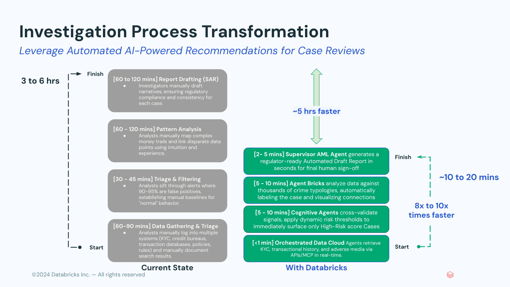

<p align="center">
  
</p>

<p align="center">
  <strong>An agentic AML investigation workspace, built on the Databricks Data Intelligence Platform.</strong>
</p>

<div align="center">

[](https://databricks.com/)
[](https://python.org/)
[](https://fastapi.tiangolo.com/)
[](LICENSE.md)

</div>

---

## The story

Anti-money-laundering is a $206B/year global compliance line item, and the people doing the work are drowning.

A typical AML investigator opens an alert and then spends **3–6 hours** chasing it. They sign into ten or more separate systems — KYC, transaction monitoring, sanctions screening, credit bureau, case management — copy data out by hand, map relationships on a notepad, and finally hand-draft a SAR narrative from scratch. **Ninety percent of those alerts turn out to be false positives**, but every one of them gets the full 3–6 hour treatment because nothing connects the dots automatically. The backlog grows faster than they can clear it.

Their boss has a different problem. The Head of AML is trying to demonstrate program effectiveness to regulators with flat budgets, increasing scrutiny, and the board asking pointed questions. **Forty-two percent of their time goes to compliance reporting**, and most of the underlying evidence is stitched together from Excel exports.

The pain isn't one tool. It's that AML investigation is a *data and reasoning* problem trapped inside ten siloed *systems* — and the analyst is the integration layer.

### Two personas, one workflow

> **Sarah Chen — AML Investigator** *(first-line user)*
> *"I spend 3–6 hours per case manually gathering data across 10+ systems. 90% of alerts are false positives but still require full investigation. I'm writing the same SAR narratives from scratch every week. The backlog is growing faster than I can clear it."*
>
> **Top KPIs:** False Positive Rate · Case Processing Time · SAR Quality Score

> **Marcus Johnson — AML Investigation Unit Lead** *(buyer)*
> *"It's hard to demonstrate AML program effectiveness to regulators while budgets stay flat. Forty-two percent of my time goes to compliance reporting. I'm afraid of enforcement actions and reputational damage. I need audit-ready documentation that shows our controls are working."*
>
> **Top KPIs:** Alert Backlog · Regulatory Exam Readiness · Detection Rate

---

## What SherlockAML changes

The Databricks Data Intelligence Platform collapses the ten siloed systems into one governed lakehouse, and lets a small set of AI agents do the data-gathering, pattern analysis, and narrative drafting that the human investigator used to do by hand. The human stays in the loop for judgment and sign-off — the agents do the busywork.

<p align="center">
  
</p>

| Investigation step | Before | After |
|---|---|---|
| Data gathering across 10+ systems | 60–90 min manual | <1 min via orchestrated data agents |
| Triage & filtering (90–95% false positives) | 30–45 min manual | 5–10 min via cognitive agents that score and surface only high-risk cases |
| Pattern analysis & link discovery | 60–120 min manual | 5–10 min via Agent Bricks matching against thousands of crime typologies |
| SAR narrative drafting | 60–120 min manual | 2–5 min via the supervisor agent → regulator-ready draft for human sign-off |
| **End-to-end** | **3–6 hours** | **~10–20 minutes** |

**Expected outcomes for a large institution:** 8–10x faster case processing · ~75% reduction in false positives · $5–10M annual efficiency gain · audit-ready SAR documentation by default.

---

## What's in this repo

SherlockAML is a complete, partner-deployable reference solution:

- **A FastAPI + React investigation app** — three surfaces (Executive Overview, Alert Investigation, Graph Explorer) backed by a Multi-Agent Supervisor over three Knowledge Assistants, two Genie Spaces, and an optional external web-search MCP server.
- **A self-contained data bundle** — synthetic AML data (customers, transactions, alerts, cases, SAR filings) plus an executive dashboard. Generated fresh on every deploy.
- **Automated agent provisioning** — the data bundle's pipeline ends by creating the full agent graph in the target workspace, so a partner gets the same investigator surface with no manual UI clicks.
- **Optional Lakebase backend** — graph queries can be served from a managed Postgres instance for sub-10ms reads when the workload demands it.

```
fins-aml-amer/
├── README.md                           ← you are here
├── LICENSE.md  NOTICE.md  CONTRIBUTING.md  SECURITY.md
├── assets/                             ← logo, diagrams
├── fins-aml-app-bundle/                ← the investigation app (FastAPI + React)
│   ├── app.yaml, databricks.yml        ← bundle + Apps runtime config
│   ├── main.py
│   ├── backend/                        ← FastAPI handlers
│   │   ├── api/                        ← chat, sar, investigation, graph endpoints
│   │   └── services/                   ← Delta SQL + Lakebase clients, auth
│   └── frontend/build/index.html       ← single-file React app
├── fins-aml-data-bundle/               ← synthetic data + agent provisioning
│   ├── databricks.yml
│   ├── notebooks/                      ← 01-04: data gen → screening → graph → KB docs
│   ├── export_agents.py                ← read-only introspection of the agent graph
│   ├── provision_agents.py             ← idempotent replay into any target workspace
│   └── agents/                         ← captured JSON specs (MAS, KAs, Genies, MCP)
└── legacy/neo4j-integration/           ← reference Neo4j graph backend (not active)
```

---

## Deploy

The repo ships as two Databricks Asset Bundles. Deploy the data bundle first (it creates the tables, volumes, dashboard, **and** the agents the app calls), then the app bundle.

### Prerequisites

**Tooling on your laptop:**
- Databricks CLI **v0.299.1 or newer** (`brew upgrade databricks` or [install instructions](https://docs.databricks.com/en/dev-tools/cli/install.html))
- A configured CLI profile pointing at your target workspace (`databricks auth login --host https://<your-workspace>.cloud.databricks.com --profile <your-profile>`)

**Workspace features that must be enabled** (your workspace admin can confirm):
- Unity Catalog (any new workspace; verify via `databricks catalogs list`)
- Serverless compute for jobs (the data bundle uses serverless exclusively)
- Agent Bricks — Knowledge Assistants and Multi-Agent Supervisors must be available in the workspace UI under "Agents"
- Genie Spaces (visible under "Genie" in the left nav)
- Vector Search (Knowledge Assistants provision their own VS endpoints automatically; you only need the feature itself enabled)
- *(Optional, only if you set `USE_LAKEBASE=true`)* Lakebase Autoscaling — verify with `databricks postgres list-projects --profile <your-profile>` returns a result, even if empty

**Workspace permissions for whoever runs the deploy:**
- CAN_USE on a SQL warehouse
- CAN_MANAGE on the catalog and schema you'll create
- Permission to create Knowledge Assistants, Genie Spaces, and Multi-Agent Supervisors

**Optional secret:**
- A You.com API key from [you.com/developer](https://you.com/developer), if you want web-search as a 6th sub-agent

### 1. Configure your target

Copy the `example` target in `fins-aml-app-bundle/databricks.yml` and fill in the values you already have. **Leave `mas_endpoint_url` and `dashboard_id` as placeholders for now** — they're outputs of step 2 and you'll backfill them in step 3.

```yaml
targets:
  my-workspace:
    mode: development
    default: true
    workspace:
      host: https://<your-workspace>.cloud.databricks.com
    variables:
      databricks_hostname: "<your-workspace>.cloud.databricks.com"
      workspace_id: "<numeric-workspace-id>"
      warehouse_id: "<sql-warehouse-id>"
      mas_endpoint_url: "PLACEHOLDER-WILL-BACKFILL-AFTER-STEP-2"
      dashboard_id: "PLACEHOLDER-WILL-BACKFILL-AFTER-STEP-2"
```

### 2. Deploy and run the data bundle

The data bundle creates everything the app depends on: catalog tables, the synthetic knowledge-base volume, the Lakeview dashboard, and the full agent graph (3 KAs, 2 Genie Spaces, the MAS, and optionally the You.com MCP).

```bash
cd fins-aml-data-bundle

# (Optional) Set up the You.com MCP secret first if you want web search.
# Without this, the MAS comes up with 5 sub-agents instead of 6.
databricks secrets create-scope youcom --profile <your-profile>
databricks secrets put-secret youcom api_key --profile <your-profile>
# Paste your you.com API key when prompted.

# Deploy resource definitions.
databricks bundle deploy --profile <your-profile> \
  --var catalog=<your-catalog> \
  --var schema=<your-schema> \
  --var warehouse_id=<your-warehouse-id> \
  --var force_rebuild=false \
  --var youcom_secret_scope=youcom \
  --var youcom_secret_key=api_key

# Run the pipeline. This generates data AND provisions the agent graph.
databricks bundle run aml_data_generation_pipeline --profile <your-profile>
```

The pipeline runs six tasks in order: `process_dashboard_template → generate_base_data → watchlist_screening → graph_model → knowledge_base → provision_agents`. Expect **60–120 minutes total**; the Knowledge Base notebook (LLM-generated SAR narratives, EDD memos, adverse-media reports) and the final Knowledge Assistant indexing inside `provision_agents` are the two longest steps. When it finishes you'll have:

- All tables under `<catalog>.<schema>.*`
- The `knowledge_base` volume populated with synthetic PDFs, SAR narratives, EDD memos, and adverse-media reports
- The "AML Executive Dashboard" registered in the workspace
- A working Multi-Agent Supervisor with 3 Knowledge Assistants, 2 Genie Spaces, and (if you set the You.com secret) 1 external MCP server — all ready for the app to call

If you set up the You.com MCP, the first time anyone uses one of its tools in the Databricks playground, they'll be prompted to approve it. This is a one-time per-workspace action.

### 3. Backfill the MAS endpoint URL and dashboard ID

Read the two values produced by step 2 and update your target in `fins-aml-app-bundle/databricks.yml`.

```bash
# The MAS endpoint name (it'll look like mas-xxxxxxxx-endpoint):
databricks api get "/api/2.0/tiles?tile_type=MAS" --profile <your-profile> \
  | python3 -c "import json,sys; \
    [print(t['serving_endpoint_name']) for t in json.load(sys.stdin)['tiles'] \
     if t['name']=='FIN-AML-mas']"

# The dashboard ID:
databricks api get "/api/2.0/lakeview/dashboards" --profile <your-profile> \
  | python3 -c "import json,sys; \
    [print(d['dashboard_id']) for d in json.load(sys.stdin)['dashboards'] \
     if d['display_name']=='AML Executive Dashboard']"
```

Plug those into the target:
```yaml
mas_endpoint_url: "https://<your-workspace>.cloud.databricks.com/serving-endpoints/<mas-endpoint-name>/invocations"
dashboard_id: "<dashboard-id>"
```

### 4. Deploy the app

```bash
cd ../fins-aml-app-bundle
./deploy.sh my-workspace <your-profile>
```

`deploy.sh` validates the bundle, runs `databricks bundle deploy` to register the app resource and upload code, resolves the `${var.xxx}` references in `app.yaml` for your target, uploads the resolved file, and runs `databricks apps deploy`. The first deploy takes a few minutes; subsequent deploys are faster.

The app URL is printed at the end of the deploy. Open it, sign in with your Databricks identity, and you should see the Executive Overview load with the data the bundle generated.

---

## Optional: Lakebase as the graph backend

For graph-heavy use cases — the customer subgraph view, the Graph Explorer — the app can read from a Lakebase Postgres instance instead of the SQL warehouse. Postgres queries land in single-digit milliseconds vs warehouse queries that often take 500ms–2s.

The app's behaviour is identical either way; only the underlying read path changes. If Lakebase is ever unreachable mid-request, the app automatically falls back to the SQL warehouse and logs a warning. Flipping the flag on is reversible with a one-line change + redeploy.

### Setup

Run these commands once. They take ~10 minutes total (most of which is the project waiting for its endpoint to come online).

```bash
PROFILE=<your-profile>
PROJECT=fins-aml-graph              # or your preferred name
DATABASE=fins_aml_graph             # the database inside the project

# 1. Provision the project. Auto-creates a production branch + primary endpoint.
databricks postgres create-project $PROJECT \
  --json '{"spec": {"display_name": "FINS AML Graph"}}' \
  --profile $PROFILE

# 2. Wait until the endpoint reports ACTIVE (usually 1-2 minutes).
until [ "$(databricks postgres list-endpoints projects/$PROJECT/branches/production \
    --profile $PROFILE -o json | python3 -c \
    'import json,sys; print(json.load(sys.stdin)[0][chr(34)+chr(115)+chr(116)+chr(97)+chr(116)+chr(117)+chr(115)+chr(34)][chr(34)+chr(99)+chr(117)+chr(114)+chr(114)+chr(101)+chr(110)+chr(116)+chr(95)+chr(115)+chr(116)+chr(97)+chr(116)+chr(101)+chr(34)])')" = "ACTIVE" ]; do
  sleep 5
done

# 3. Capture connection details.
HOST=$(databricks postgres list-endpoints projects/$PROJECT/branches/production \
  --profile $PROFILE -o json | python3 -c \
  "import json,sys; print(json.load(sys.stdin)[0]['status']['hosts']['host'])")
TOKEN=$(databricks postgres generate-database-credential \
  projects/$PROJECT/branches/production/endpoints/primary \
  --profile $PROFILE -o json | python3 -c \
  "import json,sys; print(json.load(sys.stdin)['token'])")
EMAIL=$(databricks current-user me --profile $PROFILE -o json | python3 -c \
  "import json,sys; print(json.load(sys.stdin)['userName'])")
PG="host=$HOST port=5432 dbname=postgres user=$EMAIL sslmode=require"

# 4. Create the database, the graph schema, and grant read access to PUBLIC.
PGPASSWORD="$TOKEN" psql "$PG" -c "CREATE DATABASE $DATABASE;"
PGPASSWORD="$TOKEN" psql "host=$HOST port=5432 dbname=$DATABASE user=$EMAIL sslmode=require" <<'SQL'
CREATE TABLE graph_nodes (
    node_id        BIGINT NOT NULL,
    node_type      TEXT   NOT NULL,
    node_label     TEXT,
    risk_score     BIGINT,
    risk_category  TEXT,
    properties     JSONB,
    PRIMARY KEY (node_id, node_type)
);
CREATE TABLE graph_edges (
    edge_id           BIGINT PRIMARY KEY,
    source_node_id    BIGINT NOT NULL,
    source_node_type  TEXT,
    target_node_id    BIGINT NOT NULL,
    target_node_type  TEXT,
    edge_type         TEXT,
    weight            DOUBLE PRECISION,
    properties        JSONB
);
CREATE INDEX idx_edges_source ON graph_edges (source_node_id, source_node_type);
CREATE INDEX idx_edges_target ON graph_edges (target_node_id, target_node_type);
CREATE INDEX idx_edges_type   ON graph_edges (edge_type);
CREATE INDEX idx_nodes_type   ON graph_nodes (node_type);

GRANT USAGE  ON SCHEMA public            TO PUBLIC;
GRANT SELECT ON ALL TABLES IN SCHEMA public TO PUBLIC;
ALTER DEFAULT PRIVILEGES IN SCHEMA public GRANT SELECT ON TABLES TO PUBLIC;
SQL

# 5. Create a Postgres role for the app's service principal so it can connect
#    via OAuth. Replace <app-sp-client-id> with the client_id from
#    `databricks apps get the-fins-aml-app --profile $PROFILE`.
databricks postgres create-role projects/$PROJECT/branches/production \
  --json '{"spec":{"postgres_role":"<app-sp-client-id>","auth_method":"LAKEBASE_OAUTH_V1","identity_type":"SERVICE_PRINCIPAL"}}' \
  --profile $PROFILE
```

You now have an empty Lakebase Postgres with the right schema and grants. Load your graph data into it — either as a one-shot copy from the UC `graph_nodes` / `graph_edges` tables (see `fins-aml-data-bundle/notebooks/` for a Python recipe), or via a UC → Lakebase synced table for ongoing sync.

### Enable in the app

Set these in your target in `fins-aml-app-bundle/databricks.yml`, then redeploy the app:

```yaml
use_lakebase: "true"
lakebase_host: "ep-xxx.database.<region>.cloud.databricks.com"   # from step 3 above ($HOST)
lakebase_database: "fins_aml_graph"
lakebase_endpoint_path: "projects/fins-aml-graph/branches/production/endpoints/primary"
```

Verify by loading the Graph Explorer — queries should return in tens of milliseconds, and the Lakebase user_table stats (`SELECT * FROM pg_stat_user_tables WHERE relname IN ('graph_nodes','graph_edges')`) will show index-scan counts climbing.

---

## Customization for partners

This repo is meant to be forked, cloned, or vendored. A partner taking this on:

- **Replace the synthetic data**: keep the data bundle structure, swap the generation notebooks for your own data sources. The downstream agent prompts and the app's queries reference the table schemas, not the data content.
- **Adjust the agent graph**: the MAS, its three KAs, two Genie Spaces, and the MCP connection are all captured as JSON under `fins-aml-data-bundle/agents/`. Edit those files (descriptions, instructions, table/document references) before running `bundle deploy` and you get a different agent graph in the target workspace.
- **Swap the graph backend**: a Neo4j reference implementation lives in [`legacy/neo4j-integration/`](legacy/neo4j-integration/README.md) for teams who'd prefer a labeled-property graph database over Delta/Lakebase.
- **Restyle the frontend**: it's a single React file (`frontend/build/index.html`) with inline-styled components — no build pipeline, no bundler. Swap colors and typography directly.

---

## Architecture (one-line version)

User → React app → FastAPI → (Multi-Agent Supervisor over 3 KAs + 2 Genies + 1 MCP) and/or (Lakebase Postgres for graph reads) → Unity Catalog tables and volumes that the data bundle owns.

The agents are stateless; everything reproducible from the bundle.

---

## Support, contributing

- **Issues / bugs**: open a GitHub issue on this repo
- **Contributing**: see [CONTRIBUTING.md](CONTRIBUTING.md). Bricksters only per FE policy
- **Security disclosures**: see [SECURITY.md](SECURITY.md)
- **License**: [Databricks License](LICENSE.md)

---

## Credits

Built by the Databricks FSI ProServ + AI Acceleration teams:
**Emerson Bayuk** · **Kateryna Savchyn** · **Mimi Park** · **Pavithra Rao**

Powered by Databricks Apps, Unity Catalog, Agent Bricks (Knowledge Assistants, Genie Spaces, Multi-Agent Supervisors), Vector Search, AI Gateway, and Lakebase.
