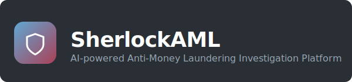
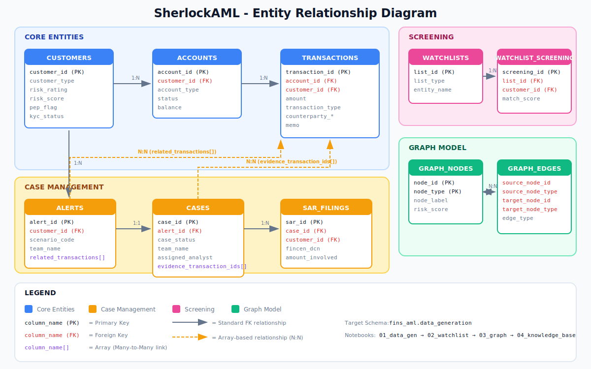

<p align="center">
  
</p>

<p align="center">
  <em>Complete end-to-end solution with synthetic data generation, multi-agent investigation workflows, and interactive dashboards</em>
</p>

<div align="center">

[](https://databricks.com/)
[](https://python.org/)
[](https://reactjs.org/)
[](https://fastapi.tiangolo.com/)

</div>

---

## 📁 Repository Structure

<div align="left">

```
fins-aml-amer/
├── 📄 README.md                     # This documentation
├── 🎨 assets/                       # Images and visual assets
│   └── 🖼️  sherlock-banner.svg       # SherlockAML banner logo
├── 🔢 fins-aml-datagen/             # Core data pipeline and analysis notebooks
│   ├── 🏗️  01_aml_data_generation    # Core tables + alerts/cases/SARs + views
│   ├── 🎯 02_aml_watchlist_screening # Watchlist and sanctions screening
│   ├── 🕸️  03_aml_graph_model        # Graph nodes & edges for network viz
│   ├── 📚 04_aml_knowledge_base     # Unstructured docs for RAG
│   └── 📋 docs/                     # Documentation and diagrams
│       ├── 🎨 banner.svg            # Platform banner
│       └── 📊 erd_updated.svg       # Entity relationship diagram
├── 📊 dashboards/                   # Lakeview dashboard exports
│   └── 🎯 SherlockAML_ExecDash_Final.lvdash.json  # Executive dashboard
└── 🖥️  fins-aml-app/                # Interactive investigation application
    ├── ⚡ main.py                   # Databricks application entry point
    ├── 🔧 backend/                  # FastAPI backend services
    ├── 🎨 frontend/                 # React frontend components
    └── 📦 requirements.txt          # Python dependencies
```

</div>

## 🔄 Notebook Execution Order

> Run notebooks in this sequence — each depends on tables created by previous steps.

| Step | 📓 Notebook | 🏗️ Creates | 🔗 Dependencies |
|------|-------------|------------|-----------------|
| **1** | `01_aml_data_generation` | `customers`, `accounts`, `transactions`, `alerts`, `cases`, `sar_filings`, `case_audit_log`, + 5 views | None |
| **2** | `02_aml_watchlist_screening` | `watchlists`, `watchlist_hits` | Step 1 |
| **3** | `03_aml_graph_model` | `graph_nodes`, `graph_edges` | Steps 1-2 |
| **4** | `04_aml_knowledge_base` | Knowledge base volume (RAG docs) | Step 1 |

## 🖥️ Interactive Investigation Application

The `fins-aml-app/` folder contains a complete web-based investigation platform built on **Databricks App Framework**. The application provides:

<div align="left">

- 🤖 **Multi-agent Investigation Workflow** - AI-powered analyst, executive, and agent roles
- 📋 **Interactive Case Management** - Real-time case investigation with document analysis
- 🕸️ **Graph Visualization** - Network analysis for relationship mapping
- 📑 **SAR Generation** - Automated Suspicious Activity Report creation
- 🔍 **Knowledge Base Integration** - RAG-powered document search and analysis

</div>

> 💡 **Deployment**: Navigate to the `fins-aml-app/` directory and follow the deployment instructions in that folder's documentation.

## 📊 Dashboard Configuration

The application includes embedded Lakeview dashboards for executive reporting. After importing the dashboard:

### 🔧 Configure Dashboard IDs

1. **Import Dashboard**: Use the Databricks UI to import `dashboards/SherlockAML_ExecDash_Final.lvdash.json`
2. **Copy Dashboard ID**: From the dashboard URL in your workspace
3. **Update Configuration**: Modify the dashboard ID in `fins-aml-app/backend/api/auth.py`:

```python
# Line 52: Update with your imported dashboard ID
dashboard_id = "YOUR_DASHBOARD_ID_HERE"
```

### 🔐 Authentication Setup

The app supports multiple authentication methods:
- **Service Principal** (recommended for production)
- **Personal Access Token** (development/testing)
- **User Token** (workspace users)

## Entity Relationship Diagram



### Table Joins

| From Table | Join Key | To Table | Relationship |
|------------|----------|----------|--------------|
| `accounts` | `customer_id` | `customers` | Many-to-One |
| `transactions` | `customer_id` | `customers` | Many-to-One |
| `transactions` | `account_id` | `accounts` | Many-to-One |
| `alerts` | `customer_id` | `customers` | Many-to-One |
| `alerts` | `account_id` | `accounts` | Many-to-One |
| `alerts` | `related_transactions[]` | `transactions.transaction_id` | Many-to-Many (array) |
| `cases` | `alert_id` | `alerts` | One-to-One |
| `cases` | `customer_id` | `customers` | Many-to-One |
| `cases` | `evidence_transaction_ids[]` | `transactions.transaction_id` | Many-to-Many (array) |
| `sar_filings` | `case_id` | `cases` | Many-to-One |
| `sar_filings` | `customer_id` | `customers` | Many-to-One |
| `case_audit_log` | `case_id` | `cases` | Many-to-One |
| `watchlist_hits` | `customer_id` | `customers` | Many-to-One |
| `watchlist_hits` | `list_id` | `watchlists` | Many-to-One |
| `graph_edges` | `source_node_id` | `graph_nodes.node_id` | Many-to-One |
| `graph_edges` | `target_node_id` | `graph_nodes.node_id` | Many-to-One |

## Detection Scenarios

Synthetic data includes pre-seeded patterns for 9 AML scenarios:

| Scenario | Customer IDs | Rule |
|----------|--------------|------|
| Structuring | 1-50 | ≥3 cash deposits $9K-$9,999 in 7 days |
| Rapid Movement | 51-100 | >$50K in/out within 24hrs, <5% retained |
| Dormant Reactivation | 101-150 | 12+ months inactive, then >$20K/week |
| High-Risk Geography | 151-200 | >$10K wire to FATF blacklisted country |
| Round Dollar | 201-250 | ≥10 round-dollar transfers/day |
| Beneficiary Mismatch | 251-300 | Payment to unrelated beneficiary |
| Third-Party Deposits | 301-350 | >3 third-party deposits in 7 days |
| Related Accounts | 351-400 | ≥3 transfers between linked accounts |
| PEP/Sanctions | 401-450 | Transaction with PEP or OFAC match |

## Knowledge Base Documents

The Knowledge Assistant uses a hybrid corpus of real regulatory documents and synthetic customer-specific documents.

### Regulatory & Policy Documents (Downloaded Automatically)

These publicly available documents are downloaded when running `04_aml_knowledge_base`:

| Category | Document | Source | Description |
|----------|----------|--------|-------------|
| **FFIEC** | [Appendix F - Red Flags](https://bsaaml.ffiec.gov/docs/manual/10_Appendices/07.pdf) | FFIEC | Money laundering and terrorist financing red flag indicators |
| **FFIEC** | [CIP Examination Manual](https://www.fdic.gov/news/financial-institution-letters/2021/fil21012b.pdf) | FDIC | Customer Identification Program requirements |
| **FinCEN** | [SAR Narrative Guidance](https://www.irs.gov/pub/irs-tege/itg_sarc_prep.pdf) | IRS/FinCEN | How to prepare complete SAR narratives (who/what/when/where/why) |
| **FinCEN** | [CTR Reference Guide](https://www.fincen.gov/system/files/shared/CTRPamphlet.pdf) | FinCEN | $10K threshold, aggregation rules, structuring examples |
| **FinCEN** | [CDD Rule FAQs](https://www.fincen.gov/system/files/2018-04/FinCEN_Guidance_CDD_FAQ_FINAL_508_2.pdf) | FinCEN | Customer Due Diligence requirements |
| **FinCEN** | [Beneficial Ownership FAQs](https://www.fincen.gov/system/files/2016-09/FAQs_for_CDD_Final_Rule_(7_15_16).pdf) | FinCEN | Beneficial ownership identification requirements |
| **OFAC** | [Compliance Framework](https://ofac.treasury.gov/media/16331/download?inline=) | Treasury | 5 pillars of sanctions compliance |
| **OFAC** | [Instant Payments Guidance](https://ofac.treasury.gov/system/files/126/instant_payment_systems_compliance_guidance_brochure.pdf) | Treasury | Risk-based sanctions compliance for instant payments |
| **Internal** | [VLS Finance AML Policy](https://www.vlsfinance.com/wp-content/uploads/2022/01/Anti-Money-Laundering-Policy.pdf) | VLS Finance | Sample institution AML policy with KYC procedures |
| **Internal** | [JAB AML Policy](https://www.jabholco.com/img/pdf/JAB_AML_Policy.pdf) | JAB Holding | Detailed red flags list for suspicious activity |
| **Internal** | [HRW AML Policy](https://www.hrw.org/sites/default/files/news_attachments/hrw-anti-money-laundering-policy-december2016.pdf) | Human Rights Watch | Donor/supplier due diligence procedures |
| **Internal** | [MultiChoice AML Policy](https://investors.multichoice.com/pdf/policies-and-charters/2024/mcg-anti-money-laundering-policy.pdf) | MultiChoice | Corporate AML framework (2024) |

### Synthetic Customer Documents (Generated)

These documents are generated from the structured data and linked to specific customers:

| Document Type | Folder | Description | Linked To |
|---------------|--------|-------------|-----------|
| **SAR Narratives** | `sar_narratives/` | Complete SAR filing narratives with regulatory citations | `customer_id`, `sar_id` |
| **Case Notes** | `case_notes/` | Investigation timelines with AI assistant query logs | `case_id`, `customer_id`, `alert_id` |
| **EDD Memoranda** | `edd_memos/` | Enhanced Due Diligence reviews for high-risk customers | `customer_id` |
| **Adverse Media** | `adverse_media/` | Media screening reports with disposition | `customer_id` |
| **Correspondence** | `correspondence/` | Customer interaction logs (branch visits, calls) | `customer_id` |

### Knowledge Base Folder Structure

```
/Volumes/fins_aml/data_generation/knowledge_base/
├── policies_and_regulations/
│   ├── ffiec/                    # FFIEC exam manual, red flags
│   ├── fincen/                   # SAR, CTR, CDD guidance
│   ├── ofac/                     # Sanctions compliance
│   └── internal/                 # Institution AML policies
├── sar_narratives/               # ~15-25 SAR narratives
├── case_notes/                   # ~30-50 investigation notes
├── edd_memos/                    # ~40-60 EDD reviews
├── adverse_media/                # ~50-80 screening reports
└── correspondence/               # ~40-70 interaction logs
```

## Configuration

All notebooks use:
```python
CATALOG = "fins_aml"
SCHEMA = "data_generation"
```

## 🚀 Quick Start - Bundle Deployment (Recommended)

> **New in v2.0**: Automated deployment using Databricks Asset Bundles for data pipeline and dashboards

### 📦 Bundle Architecture

This repository now includes **two separate bundles** for clean separation of concerns:

| Bundle | Purpose | Dependencies | Location |
|--------|---------|--------------|----------|
| **Data Bundle** | Data generation pipeline + Dashboard | None (standalone) | `fins-aml-data-bundle/` |
| **App Bundle** | Interactive investigation app | Neo4j, MAS endpoints | `fins-aml-app-bundle/` |

### 🔧 Prerequisites

1. **Databricks CLI** installed and configured
2. **SQL Warehouse** ID from your workspace
3. **Databricks CLI Profile** configured for your workspace:
   ```bash
   databricks auth login --host https://your-workspace.cloud.databricks.com --profile your-workspace
   ```

### 📊 Step 1: Deploy Data Pipeline & Dashboard

```bash
# Navigate to data bundle
cd fins-aml-data-bundle

# Deploy bundle with your parameters
databricks bundle deploy --profile your-workspace \
  --var="catalog=your_catalog" \
  --var="schema=your_schema" \
  --var="warehouse_id=your_warehouse_id"

# Run data generation pipeline (one-time)
databricks bundle run aml_data_generation_pipeline --profile your-workspace

# The job is scheduled monthly but starts PAUSED
# Activate in Databricks UI if needed
```

**Bundle Variables:**
- `catalog`: Unity Catalog name (default: "fins_aml")
- `schema`: Schema name (default: "data_generation")
- `force_rebuild`: Rebuild existing tables - "true"/"false" (default: "false")
- `warehouse_id`: Your SQL warehouse ID (required)

**Example with custom catalog/schema:**
```bash
databricks bundle deploy --profile my-workspace \
  --var="catalog=test_catalog" \
  --var="schema=test_schema" \
  --var="force_rebuild=true" \
  --var="warehouse_id=abc123def456"
```

**What this deploys:**
- ✅ Automated workflow running notebooks 01→02→03→04 sequentially
- ✅ Lakeview dashboard with automatic warehouse connection
- ✅ Monthly schedule (1st of month at 2 AM PT, starts paused)
- ✅ Email notifications on failure

### 🖥️ Step 2: Deploy Application (Optional)

> **Note**: App deployment requires Neo4j and MAS endpoint credentials

```bash
# Navigate to app bundle
cd fins-aml-app-bundle

# Set additional environment variables
export NEO4J_PASSWORD="your-neo4j-password"
export MAS_ENDPOINT_URL="your-mas-endpoint"

# Deploy application
databricks bundle deploy -t e2-demo-west
```

---

## 🚀 Quick Start - Manual Setup (Alternative)

> Use this approach if you prefer manual control or need to customize the pipeline

### 🔢 Data Pipeline Setup
1. **Clone** this repo to your Databricks workspace
2. **Navigate** to the `fins-aml-datagen/` folder
3. **Execute** notebooks 01 → 02 → 03 → 04 in order
4. **Configure** Knowledge Assistant to index the `knowledge_base` volume

### 📊 Dashboard Setup
5. **Import** the Lakeview dashboard from `dashboards/SherlockAML_ExecDash_Final.lvdash.json`
6. **Note the new dashboard ID** from your workspace after import
7. **Update** the dashboard ID in `fins-aml-app/backend/api/auth.py` (line 52)

### 🖥️ Application Deployment
8. **Configure** environment variables for your workspace:
   - `DATABRICKS_CLIENT_ID` - Service principal client ID
   - `DATABRICKS_CLIENT_SECRET` - Service principal secret
   - `DATABRICKS_PAT_TOKEN` - Personal access token (fallback)
9. **Navigate** to the `fins-aml-app/` folder
10. **Deploy** the interactive investigation application following the deployment instructions

---

<div align="center">

**Built with ❤️ on Databricks** | **AI-Powered AML Solutions**

</div>
