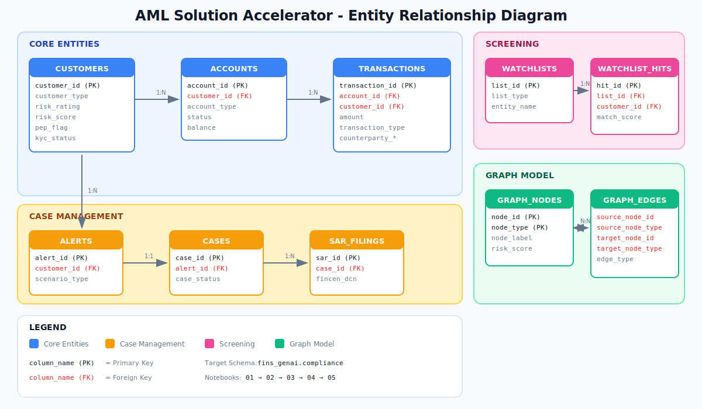

# AML Solution Accelerator

An end-to-end Anti-Money Laundering (AML) solution built on Databricks, featuring synthetic data generation, multi-agent investigation workflows, and interactive dashboards.

## Repository Structure

```
fins-aml/
├── README.md
├── 01_aml_data_generation           # Core tables + alerts/cases/SARs + views
├── 02_aml_watchlist_screening       # Watchlist and sanctions screening
├── 03_aml_graph_model               # Graph nodes & edges for network viz
├── 04_aml_knowledge_base            # Unstructured docs for RAG
└── docs/
    └── erd.svg                      # Entity relationship diagram
```

## Notebook Execution Order

Run notebooks in this sequence — each depends on tables created by previous steps.

| Step | Notebook | Creates | Dependencies |
|------|----------|---------|--------------|
| 1 | `01_aml_data_generation` | `customers`, `accounts`, `transactions`, `alerts`, `cases`, `sar_filings`, `case_audit_log`, + 5 views | None |
| 2 | `02_aml_watchlist_screening` | `watchlists`, `watchlist_hits` | Step 1 |
| 3 | `03_aml_graph_model` | `graph_nodes`, `graph_edges` | Steps 1-2 |
| 4 | `04_aml_knowledge_base` | Knowledge base volume (RAG docs) | Step 1 |

## Entity Relationship Diagram



```
                                    CORE ENTITIES
┌─────────────────┐       ┌──────────────────┐       ┌─────────────────┐
│   CUSTOMERS     │──1:N─▶│    ACCOUNTS      │──1:N─▶│  TRANSACTIONS   │
│                 │       │                  │       │                 │
│ • customer_id   │       │ • account_id     │       │ • txn_id        │
│ • risk_rating   │       │ • account_type   │       │ • amount        │
│ • pep_flag      │       │ • status         │       │ • counterparty  │
└────────┬────────┘       └──────────────────┘       └─────────────────┘
         │
         │ 1:N
         ▼
┌─────────────────┐       ┌──────────────────┐       ┌─────────────────┐
│     ALERTS      │──1:1─▶│      CASES       │──1:N─▶│   SAR_FILINGS   │
│                 │       │                  │       │                 │
│ • alert_id      │       │ • case_id        │       │ • sar_id        │
│ • scenario_type │       │ • case_status    │       │ • fincen_dcn    │
│ • priority      │       │ • disposition    │       │ • narrative     │
└─────────────────┘       └────────┬─────────┘       └─────────────────┘
                                   │ 1:N
                                   ▼
                          ┌──────────────────┐
                          │  CASE_AUDIT_LOG  │
                          └──────────────────┘

                               SCREENING
┌─────────────────┐       ┌──────────────────┐
│   WATCHLISTS    │──1:N─▶│  WATCHLIST_HITS  │◀─── CUSTOMERS
│                 │       │                  │
│ • list_type     │       │ • match_score    │
│ • entity_name   │       │ • status         │
└─────────────────┘       └──────────────────┘

                              GRAPH MODEL
┌─────────────────────┐              ┌─────────────────────────┐
│    GRAPH_NODES      │◀────────────▶│      GRAPH_EDGES        │
│                     │              │                         │
│ • node_id           │              │ • source_node_id        │
│ • node_type         │              │ • target_node_id        │
│ • risk_score        │              │ • edge_type             │
│ • properties (JSON) │              │ • weight                │
└─────────────────────┘              └─────────────────────────┘
```

## Detection Scenarios

Synthetic data includes pre-seeded patterns for 9 AML scenarios:

| Scenario | Customer IDs | Rule |
|----------|--------------|------|
| Structuring | 1-50 | ≥3 cash deposits $9K-$9,999 in 7 days |
| Rapid Movement | 51-100 | >$50K in/out within 24hrs, <5% retained |
| Dormant Reactivation | 101-150 | 12+ months inactive, then >$20K/week |
| High-Risk Geography | 151-200 | >$10K wire to FATF blacklisted country |
| Round Dollar | 201-250 | ≥10 round-dollar transfers/day |
| Beneficiary Mismatch | 251-300 | Payment to unrelated beneficiary |
| Third-Party Deposits | 301-350 | >3 third-party deposits in 7 days |
| Related Accounts | 351-400 | ≥3 transfers between linked accounts |
| PEP/Sanctions | 401-450 | Transaction with PEP or OFAC match |

## Configuration

All notebooks use:
```python
CATALOG = "fins_aml"
SCHEMA = "data_generation"
```

## Quick Start

1. Clone this repo to your Databricks workspace
2. Run notebooks 01 → 02 → 03 → 04 in order
3. Import Lakeview dashboards
4. Deploy investigation app
